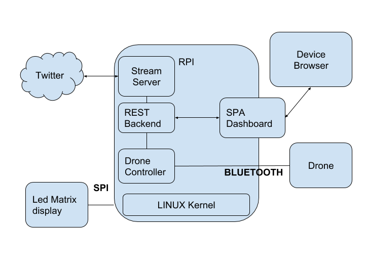

# Flip-Tweet
### Progetto per l'elaborato di PPM 
## Scope
Il progetto proposto ha lo scopo di realizzare un sistema capace di monitorare una serie di piattaforme per poter dare un feedback qualora si presenti un evento di nostro interesse. 
Nel nostro caso lo configureremo in modo che osservi una serie hashtag di Twitter, ma potrebe essere configurato anche per reagire ad una mail di un certo mittente.

### [View the documentation](../out/index.html)

## Overview
Il sistema sarà composto da un raspberry pi che farà da coordinatore per tutte le varie componenti.
Le componenti sono:

1.  un’insieme di hw di notifica connessi al rpi tramite opportuni bus hw e controllati dal software (REST Backend) tramite opportuni       kernel driver / librerie di supporto. 
    L’insieme hw per il primo test case è rappresentato da un led matrix display ed un drone parrot.
    Il display è connesso tramite SPI ed il drone tramite bluetooth.

2.  un applicativo, il REST backend che si occuperà di :
    -   interfacciarsi con l’hw avvalendosi di opportuni tools / librerie di supporto in modo da far reagire l’hw in base agli hashtag di twitter.
    -   configurare tramite una SPA ( Single Page Application) il modo in cui l’hw dovrà reagire, per esempio quale hashtag dovrà essere reindirizzato sul led matrix o quale dovrà far flippare il drone.
    -    L’interfaccia fra la SPA ed il backend è fatta tramite api REST, l’applicazione è una web app servita dal backend rest che gira sul browser del dispositivo dell’utente.

## Dependencies
Per poter utilizzare i sochal Twitter e Instagram è necessario creare un account per ogni sochal, ma svolgere compiti diversi per l'attivazione degli stream:

0.  Profilo Twitter, creazione di app e configurazione delle chiavi e dei token per configurare correttamente le impostazioni.
    -   vai alla pagina [nuova app](https://apps.twitter.com/app/new) ed esegui l'accesso a Twitter se necessario.
    -   inserisci Consumer key e Secret key negli appositi campi vuoti.
    -   genera Access Token e Secret Token ed inserisci anche quelli negli appositi campi vuoti.
1.  Riguardo ad Instagram è necessario:
    -   accedere alla pagina [sviluppatori](https://www.instagram.com/developer/) con le proprie credenziali
    -   creare un app Instagram mettendo come indirizzo di redirect 'https://127.0.0.1:3000' 
    -   andare nel file notification-proxy-dashboard/src/app/app.component.html del progetto della dashboard e immettere il proprio client_id alla riga 18 nell'url.
    -   ?
    -   Se si necessita che qualcun'altro possa accedere con il proprio client_id è necessario aggiungerlo nella sezione SandBox mode digitando il suo nome Instagram. 

## Get Started in 60 Seconds

#### 1. Creare le chiavi di Twitter per l’applicazione.
(vedi punto 0. Dependencies)
#### 2. Configurare RaspberryPi come Access Point. 
Seguire il [tutorial ufficiale](https://www.raspberrypi.org/documentation/configuration/wireless/access-point.md) per configurare correttamente il RaspberryPi.
#### 3. Clonare il progetto da GitHub

    $ git clone https://github.com/CesareVin/flip-tweet.git
#### 4. Configura le chiavi
Nel file config.js sostituire adeguatamente le chiavi e i token con quelli generati al punto **1.** .
#### 5. Fai partire il servizio e connettiti
È possibile con il semplice comando 

    $node index.js 
rendere disponibile il servizio server web e nel progetto [notification-proxy-dashboard](https://github.com/CesareVin/notification-proxy-dashboard) seguire i comandi per servire la Dashboard.

## Changelog

### 2.0.0
- Aggiunta sochal Instagram
- Modifica documentazione
- Modifica file README.md

### 1.3.0
- Rimozione Flip drone
- Cambio interfaccia

### 1.2.0
- Aggiunta documentazione API tramite Swagger
- Aggiunta della cartella app, e servizio pagina rest

### 1.1.0
- Aggiunta di documentazione
- Flip drone

### 1.0.0
- Twitter streaming
- Interfacciamento con le API